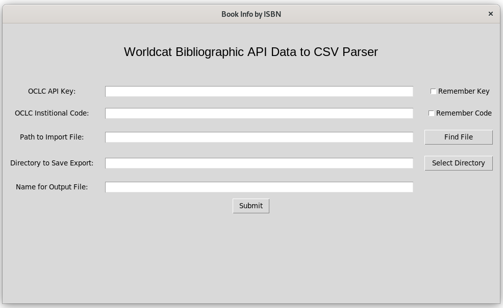

# OCLC Worldcat Search API Data to CSV Parser

**Table of Contents:**

1. [Overview](#overview)
	- [Description](#description)
	- [Requirements](#requirements)
	- [How to Use](#how-to-use)
1. [Installation](#installation)
	 - [Windows Installer](#windows-installer)
	 - [Run as a Script](#run-as-a-script)
1. [License](#licence)

## **Overview**

### Description
This program imports a csv file with a column of ISBNs and exports a new csv file with columns containing the following data pulled from the Worldcat Search API:
- Title
- Author
- Publisher
- Year Published
- Edition
- Price
- Where the Price was obtained
- Binding
- Whether the title is available at a specific OCLC member library or not 


### Requirements
In order to run this program you will need the following:
- A reliable Internet connection
- [An OCLC Library Membership](https://www.oclc.org/en/membership/member-resources.html)
- [An OCLC Library Code](https://www.oclc.org/en/contacts/libraries.html)
- [Request a Worldat Search API Key (Only Version 1.0 will work with this program)](https://www.oclc.org/developer/api/oclc-apis/worldcat-search-api.en.html)

If you start the program as a Python script rather than installing it with the Windows Installer Provided in this repo you'll need to manually install software dependencies.  Starting the program in the terminal using Python will work on Linux, Mac, and Windows (see the section [Run as a Script](#run-as-a-script)).  The following software must be installed on your computer in order to start this program from the terminal:
- [Python3](https://www.python.org/downloads/)
- [pip](https://www.geeksforgeeks.org/download-and-install-pip-latest-version/)
- tkinter
	- Windows: tkinter is installed automatically when you install Python3 on Windows
	- Linux (Debian Distos): Open a terminal and run: ``` sudo apt install python3-tk```
	- Mac: Check out this page on geeksforgeeks.org: https://www.geeksforgeeks.org/how-to-install-tkinter-on-macos/
- pandas: This can be installed with pip using the same terminal command for Windows, Linux, and Mac: ```pip3 install pandas```
	

### How to Use
ISBNs can be quickly scanned into a csv file that you can use to run this program.  Fill in each required field in the user interface and click the submit button at the bottom when you're ready to parse API data from the WorldCat Search.  Explaination of each field can be found below the image of the user interface.

- **OCLC API Key**: You specifically need the [WorldCat Search API v1.0.0](https://www.oclc.org/developer/api/oclc-apis/worldcat-search-api.en.html).  Version 2.0.0 will not work.  You can save your API key so that you don't have to enter it every time you open the program by clicking the checkbox to the right of the entry field.  
- **OCLC Institutional Code**: This field is where you enter your Library's OCLC Symbol.  You can look up your OCLC Symbol [here](https://www.oclc.org/en/contacts/libraries.html).  NOTE that you must be a member of OCLC in order to have an OCLC Symbol/Code.  Your code can be saved by clicking the checkbox to the right of the entry field.
- **Path to Import File**: Enter the directory path to the csv file with ISBNs you want data for. Click the "Find File" button to the right of the entry field to search for it using a file explorer.
- **Directory to Save Export**: Enter the directory path where you'd like the csv output to be saved.  Use the "Select Directory" button to the right of the entry field to find and select a directory using a file explorer.
- **Name for Output File**: Enter a name for the export file containing API data.  

This program makes 1-3 API calls for each ISBN.  It could take a while for processing to complete depending on how many ISBN's are in the import csv file and the speed of your Internet connection.  You can expect that each ISBN will take about 1-3 seconds to process with moderate Internet speeds.  

## **Installation**
This program can be installed as an application on Windows.  Simply use instructions under Windows Installer below.  In order to run this program on Linux or Mac, you will need to run it as a Python script.  See the section below for "Run as a Script".

### Windows Installer
https://www.geeksforgeeks.org/convert-python-code-to-a-software-to-install-on-windows-using-inno-setup-compiler/
https://youtu.be/p3tSLatmGvU?t=868

### Run as a Script
You can start this program in Linux, Windows, and Mac as a Python script using a command line terminal.  If this is the route you take you must be sure to install all software dependencies yourself (see the section for [Requirements](#requirements) above.  You can place the main.py file from this repo in any directory you want, but it's best to create a new directory to store the main.py file in.  The first time you run this program as a script it's going to produce a .db file that stores the program's database information in the same directory the main.py file is stored.  To run as a script start by opening a terminal (bash for Linux and Mac, PowerShell for Windows) and go to the directory where the main.py file you downloaded from this repo is located.  Both bash and PowerShell terminals can change directories by running this command: ```cd /path/to/main.py```.  Once in the proper directory run this command if you're using Windows: ```python.exe main.py``` and run this command if using Linux or Mac: ```python3 main.py```.  This should cause the user interface to appear.


## **License**
MIT No Attribution License

Copyright (c) 2023 Easter Oregon University

Permission is hereby granted, free of charge, to any person obtaining a copy of this software and associated documentation files (the “Software”), to deal in the Software without restriction, including without limitation the rights to use, copy, modify, merge, publish, distribute, sublicense, and/or sell copies of the Software, and to permit persons to whom the Software is furnished to do so.

THE SOFTWARE IS PROVIDED “AS IS”, WITHOUT WARRANTY OF ANY KIND, EXPRESS OR IMPLIED, INCLUDING BUT NOT LIMITED TO THE WARRANTIES OF MERCHANTABILITY, FITNESS FOR A PARTICULAR PURPOSE AND NONINFRINGEMENT. IN NO EVENT SHALL THE AUTHORS OR COPYRIGHT HOLDERS BE LIABLE FOR ANY CLAIM, DAMAGES OR OTHER LIABILITY, WHETHER IN AN ACTION OF CONTRACT, TORT OR OTHERWISE, ARISING FROM, OUT OF OR IN CONNECTION WITH THE SOFTWARE OR THE USE OR OTHER DEALINGS IN THE SOFTWARE.